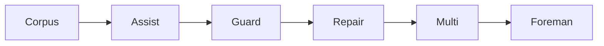

# Aragora Evolution Roadmap

> **Last updated:** 2026-04-09
> **Current transition:** early `Teammate` -> reliable `Foreman`
> **Planning rule:** preserve the maximalist vision; sequence through a narrow reliability wedge first.

## Executive Thesis

Aragora is trying to become an autonomous chief of staff, an engineering organization substrate, and a decision-integrity control plane — not just a better coding agent.

The efficient path is not to build every ambitious surface at once. The wedge is reliable autonomous software execution on bounded backlogs, with receipts, human-control surfaces, and a truthful operator view. The unified DAG GUI remains a parallel second track, but it must reflect live runtime truth rather than speculative mock state.

## Stage Model

| Stage | Product shape | Primary proof that matters | Core dependencies |
|---|---|---|---|
| **Tool** | One-shot helpful product surfaces | Bounded flows produce useful results and truthful stops | Product loops, receipts, fail-closed UX |
| **Teammate** | Scoped autonomous contributor | A single bounded task can explore, edit, verify, and escalate clearly | Session state, verification, repair evidence |
| **Foreman** | Multi-host backlog manager | Many bounded tasks can run with truthful status and low rescue overhead | Contracts, admission control, ledger, self-heal |
| **Chief of Staff** | Goal-to-plan delegation layer | Vague goals become reviewable portfolios with tradeoffs and approvals | Shared memory, planning models, human control surfaces |
| **Organization Substrate** | Unified operating system for agentic work | Cross-functional idea-to-execution flows run on one graph with auditable outputs | Unified DAG, memory fabric, receipts, heterogeneous agents |

**Current strategic obligation:** finish the `Teammate` -> `Foreman` transition before claiming broad autonomous operating-system status.

## 30 / 90 / 365 Outcome Map

| Horizon | Outcome | What must ship | Evidence that counts |
|---|---|---|---|
| **30 days** | First booster is proven | Fixed benchmark corpus, context enrichment, truthful failure taxonomy, and the first admission slices that improve real runs | Context-enriched workers complete **50%+** of bounded benchmark issues without human rescue, and **100%** of failures classify truthfully |
| **90 days** | Booster ladder becomes a product | Assisted dispatch, guarded autonomy, repair/salvage loops, truthful operator surfaces, first reviewable DAG stage, permissioned-memory baseline | Weekly multi-host runs on safe classes with bounded intervention and explicit blocker evidence |
| **365 days** | Platform expansion becomes credible | Full idea-to-execution workbench, memory + ingestion fabric, decision-integrity packages, chief-of-staff planning loops, packaged GTM motion | Cross-functional workflows with auditable receipts and repeatable customer proof |

## Reverse-Staged Rocket Bootstrap Plan

We should bootstrap semi-autonomy like a reverse-staged rocket: start with the smallest booster that can be benchmarked honestly, then use that booster to unlock the next one. The goal is not to land the whole stack in one leap; it is to prove each booster in sequence.

<!-- B0=benchmark+context, B1=human-approved dispatch, B2=contract/preflight gate, B3=auto-repair/salvage, B4=multi-host bounded autonomy -->

| Booster | Purpose | Human role | Exit signal |
|---|---|---|---|
| **B0 — Corpus** | Prove context-enriched workers on a fixed safe corpus | Human selects corpus and labels rescues honestly | `>=50%` no-rescue success and `100%` truthful failure bucketing |
| **B1 — Assist** | Auto-draft work orders, scopes, and validator plans | Human approves or edits drafts before run | Most safe tasks enter execution from machine-written work orders |
| **B2 — Guard** | Require contracts and production-like preflight before auto-run | Human only handles rejected admissions and true exceptions | Safe classes run only when contract + preflight pass |
| **B3 — Repair** | Convert common failures into retry, salvage, and quarantine flows | Human reviews edge cases instead of redoing the work | Repeated rescue classes decline sharply |
| **B4 — Multi** | Extend proven loops across hosts with truthful status | Human monitors and intervenes sparingly | Early `Foreman` behavior is routine on bounded backlogs |

**Operational law:** every time humans intervene twice for the same failure class, the next system change should absorb that rescue as product behavior.

## Program Tracks

### Track A — Reliability Substrate (Primary, Blocking)

This is the foundation that all other tracks depend on. It implements the approved reliability substrate spec for swarm and Nomic.

#### A1. Failure Taxonomy and Benchmark Corpus

- define canonical terminal truth across `needs_human`, publication, auth, validation, and task-shape failures
- harvest a benchmark corpus from real failed runs and host incidents
- make the benchmark corpus runnable in CI so regressions are visible

#### A2. WorkerContract and CredentialEnvelope

- require a persisted `WorkerContract` for every dispatchable work item
- separate runner, git, GitHub API, provider, and verification auth into explicit envelope slices
- fail closed when contract fields, permissions, or auth sources are incomplete

#### A3. Contract-Aware Preflight

- run preflight through the same command path, flags, profile, and auth shape as production
- verify read/write/commit/push/draft-PR flow in a scratch namespace
- turn host admission into a receipt rather than a shell heuristic

#### A4. Autonomy Ledger and Self-Heal

- mirror probes, queue state, contracts, receipts, and terminal outcomes into one ledger
- add automatic quarantine and fallback for stale auth, permission mismatch, rate limits, and publication failures
- cut health/reporting surfaces over to ledger-backed truth

#### A5. Nomic on the Same Substrate

- route Nomic-generated work through the same contract, preflight, and ledger path
- avoid a second reliability stack for self-improvement
- benchmark Nomic lanes against the same failure corpus

### Track B — Bounded Autonomy Control Plane

This track makes runtime truth inspectable and operable.

#### B1. Interactive Sessions and Repair Journal

- persist `explore -> plan -> edit -> verify -> repair -> publish` state by session
- make retries resume from prior state instead of re-prompting from scratch
- capture repair evidence so failure reasons become product inputs

#### B2. Task Sanitizer and Admission Gate

- classify tasks as accepted, rewritten, dropped, or quarantined before dispatch
- catch truncation, contradictory scope, impossible acceptance criteria, and missing verification contracts
- preserve original and sanitized task text for audit and debugging

#### B3. Truthful Lane and Integrator State

- unify host, runner, lane, publication, and merge-readiness state into one operator model
- expose pause, resume, retry, salvage, and quarantine operations against live state
- make the status surface match reality even when the system is degraded

#### B4. Multi-Host Soak and Unattended Criteria

- define what a trustworthy 12-hour bounded run looks like
- run repeat soak tests on the bounded backlog
- use measured rescue rate, verification pass rate, and terminal truth composition as gates

### Track C — Unified DAG Workbench (Parallel Second Track)

The GUI matters now, but only as a truthful view on the same runtime substrate.

#### C1. Canonical Graph Model

- define shared node and provenance schemas for ideas, goals, actions, orchestration, and receipts
- map contracts, approvals, and stage transitions onto that graph
- ensure graph APIs read live runtime state instead of synthetic placeholders

#### C2. Reviewable Stage Transitions

- show prompt -> spec -> work-order -> receipt transitions as first-class objects
- expose approval, replan, and escalation points at stage boundaries
- surface dissent, evidence, and risk at each handoff

#### C3. Operator Workbench

- provide lane views, run replay, intervention controls, and receipt-linked history
- support branching, comparison, and alternative plan review
- give the operator one place to understand why the system is doing what it is doing

#### C4. Full Idea-to-Execution Canvas

- extend the workbench into editable ideas -> goals -> actions -> orchestration views
- support portfolio-level planning and DAG-wide dependencies
- preserve provenance so downstream work is always traceable upstream

### Track D — Memory and Context Fabric

This track turns knowledge into a reliable advantage instead of an opaque dependency.

#### D1. Permissioned Memory Model

- store trust tier, provenance, and access boundaries for memory items
- distinguish operator instruction from retrieved context
- carry taint/provenance annotations into specs, debates, and receipts

#### D2. Large-Context Packing

- build relevance-ranked context packs for large repos and mixed knowledge sources
- expose context budgets, truncation, and evidence coverage
- benchmark whether large-context packing actually improves outcomes

#### D3. Broad Ingestion and Normalization

- normalize repos, docs, APIs, chat, and receipts into a coherent source model
- maintain source-level provenance and permission data
- detect stale or insufficient context rather than silently over-trusting inputs

#### D4. Shared Knowledge Base

- tie cross-run learning to outcomes and receipts
- provide retrieval analytics and exportability
- make memory portable enough to be a trust asset rather than lock-in

### Track E — Decision Integrity Core

This track preserves Aragora's core differentiation from generic agent platforms.

#### E1. Debate Quality and Calibration

- improve truth weighting, dissent capture, and hollow-consensus detection
- extend benchmark coverage across both decision and execution workflows
- show debate quality signals inside receipts and operator views

#### E2. External Verification and Policy Gates

- require external verifiers or stronger policies for high-impact decisions
- tie policy gates directly to execution permissions and approvals
- fail closed when verification requirements are not met

#### E3. Receipt Chain and Compliance Bundles

- strengthen cryptographic receipt envelopes and provenance links
- extend compliance artifact bundles for regulated workflows
- preserve settlement and review loops for long-horizon correctness

#### E4. Explainability and Comparison

- compare debates, runs, and outcomes side by side
- show idea -> receipt -> later-settlement lineage
- produce board- and regulator-ready exports without losing technical depth

### Track F — Trust-Wedge Productization and GTM

This track converts technical proof into market proof.

#### F1. Autonomous Software Execution

- start with a fixed benchmark corpus and prove `prompt -> spec -> code -> verify -> PR` loops on bounded repos
- measure rescue rate, verification pass rate, and wall-clock throughput
- treat every rescue as a benchmark fixture or substrate defect

#### F2. Inbox and Operator Action Loops

- preserve receipt-before-action guarantees outside software execution
- reuse contracts, memory, and approval policies across adjacent operator workflows
- capture operator feedback tied to receipts for future improvement

#### F3. Prompt-to-Spec Handoff

- turn vague requests into reviewable specs with explicit constraints and evals
- route approved specs directly into debate and execution without manual rewrite
- surface missing context and weak acceptance criteria before work begins

#### F4. Design-Partner Recurrence and Packaging

- establish weekly real-work cadence with design partners
- publish truthful proof packs and before/after benchmarks
- package the strongest repeatable wedges before expanding the story further

## Cross-Track Rules

- The same contract path should power worker launch, preflight, repair, publish, and GUI state.
- Each booster must prove a measurable gain before the next booster expands scope.
- If humans intervene twice for the same failure class, the next change should productize that rescue.
- Memory without provenance is out of scope.
- GUI surfaces must read ledger-backed truth.
- Broad vertical and enterprise expansion follows wedge proof; it does not replace it.
- External claims should always lag measured internal proof.

## Stage Exit Criteria

### Tool Exit

Bounded product loops such as debate, prompt-to-spec, and inbox actions are truthful, receipt-backed, and fail closed when assumptions break.

### Teammate Exit

A single bounded task can explore, edit, verify, repair, and escalate clearly without repeated human prompt surgery.

### Foreman Exit

Multi-host bounded backlogs run from explicit contracts with self-heal, truthful operator state, and materially lower rescue burden.

### Chief of Staff Exit

Vague goals become reviewable portfolios with tradeoffs, delegated work, approval checkpoints, and shared memory.

### Organization Substrate Exit

Cross-functional idea-to-execution work lives on one DAG with permissioned memory, heterogeneous agents, and auditable decision and execution receipts.

## Relationship to Other Canonical Docs

- [ROADMAP.md](./roadmap) is the short external/internal doorway.
- [CANONICAL_GOALS.md](./canonical-goals) defines the product boundary.
- [NEXT_STEPS_CANONICAL.md](./next-steps-canonical) defines the current tranche.
- [ACTIVE_EXECUTION_ISSUES.md](./active-execution-issues) holds the epic/milestone/execution tree.
