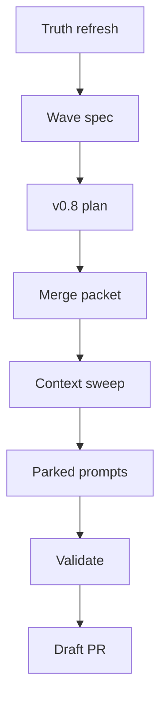

# ADC Autonomous Continuation Wave — 2026-05-19

**Status:** execution spec, strict-gated
**Worktree:** `codex/droid-20260519-151711-92e43188`
**Primary gate:** do not dispatch ADC v0.7 until the operator explicitly authorizes it after reviewing the v0.1-v0.4 merge-readiness packet.

## Objective

Preserve the Aragora Delegation Contract (ADC) planning artifacts, make the v0.8 cross-family adapter plan reviewable, produce a current merge-readiness packet for the v0.1-v0.4 base stack, and prepare-but-park v0.8 worker prompts. This wave intentionally favors operator legibility over additional autonomous fan-out.

## Hard boundaries

- No v0.7 dispatch in this turn.
- No P75 / P76 / settlement-UI dispatch from the context sweep.
- No PR merges, mark-ready, labels, force-push, protected-file edits, worker killing, foreign worktree cleanup, or branch cleanup.
- No edits to `CLAUDE.md`, `aragora/__init__.py`, `.env`, `.envrc`, `scripts/nomic_loop.py`, `docs/AGENT_OPERATING_CONTRACT.md`, `docs/governance/OPERATOR_DELEGATION_POLICY.md`, or `automation.toml`.
- Any worker prompt created by this wave is parked only.

## Execution flow



## ADC base-stack gate

Canonical audit order from `ADC_v0.1-v0.4_STACK_AUDIT.md`:

1. `#7357` — ADC v0.1 schema + predicate oracle
2. `#7361` — ADC v0.4 HMAC signing
3. `{#7358, #7360}` — ADC v0.2 lane-registry hookup and v0.3 progress ledger

Current gate result is captured in `ADC_v0.1-v0.4_MERGE_READINESS_2026-05-19.md`.

Key outcome: `#7357` is merged, `#7361` has been repaired/rebased at head `9093ddbc48ac4dd2ccaa3364b527b660c089a41e`, and `#7361`, `#7358`, and `#7360` are all `MERGEABLE` / `BLOCKED` on review with no failing checks. The original audit order is mechanically restored, but v0.7 remains parked until the operator merges the base stack or explicitly authorizes a named integration branch.

## Context sweep

Read-only sweep result:

```text
P75 agent_overlap_report.py: in-flight — #7354 open draft, DIRTY/CONFLICTING, branch droid/P75-agent-overlap-report-20260519.
P76 blocked_auth_failure: in-flight — #7352 open draft, DIRTY, branch codex/droid-20260519-042102-21e078d9; older #7265 merged, #7271 closed.
Settlement UI: in-flight — #7268 open draft, CLEAN, branch codex/settlement-packet-ui-20260517; older #7266 closed.
Older queue-settlement packet: in-flight — #7263 open draft, BLOCKED, branch worktree-open-queue-settlement-2026-05-17; #7279 operator-decisions ingestion is merged.
```

No follow-up dispatch is authorized from this sweep. It exists only to reduce duplicate work and keep the next fan-out decision legible.

## Parked v0.8 prompt pack

Dispatcher-local prompts were prepared under `.aragora/v16-dispatch/`:

- `ADC-v0.8-envelope-and-validator.md`
- `ADC-v0.8-droid-adapter.md`
- `ADC-v0.8-claude-codex-stubs.md`

They are explicitly parked until v0.7 ships or the operator waives that prerequisite.

## Operator decision needed

To unblock v0.7:

1. Merge/review the base stack in order `#7361 → {#7358, #7360}`; then
2. Authorize v0.7 dispatch from current `main` using `.aragora/v16-dispatch/dispatch-adc-v0.7.sh`.

Until that decision is made, the correct autonomous action is documentation, readiness reporting, and prompt preparation only.

## Adjacent Lane Sweep — 2026-05-19T16:20Z

```text
P75 agent_overlap_report.py: in-flight — #7354 open draft, DIRTY/CONFLICTING, branch droid/P75-agent-overlap-report-20260519; older #7270 closed unmerged, #7267 merged adjacent overlap-detector work.
P76 blocked_auth_failure: in-flight — #7352 open draft, DIRTY, branch codex/droid-20260519-042102-21e078d9; older #7265 merged, #7271 closed.
Settlement UI: in-flight — #7268 open draft, CLEAN, branch codex/settlement-packet-ui-20260517; older #7266 closed unmerged.
Older queue-settlement work: stale — #7263 open draft/BLOCKED, #7278 open draft/CLEAN but stacked on closed #7277, and #7279 operator-decisions ingestion merged.
```

No adjacent-lane dispatch is authorized from this sweep.

## Validation requirements for this wave

- `git diff --check`
- Review `git diff` / `git diff --cached` for secrets or sensitive local paths.
- Run `bash scripts/automation_pr_preflight.sh origin/main HEAD` before pushing the docs-only PR.
- Open one draft PR with no labels.
