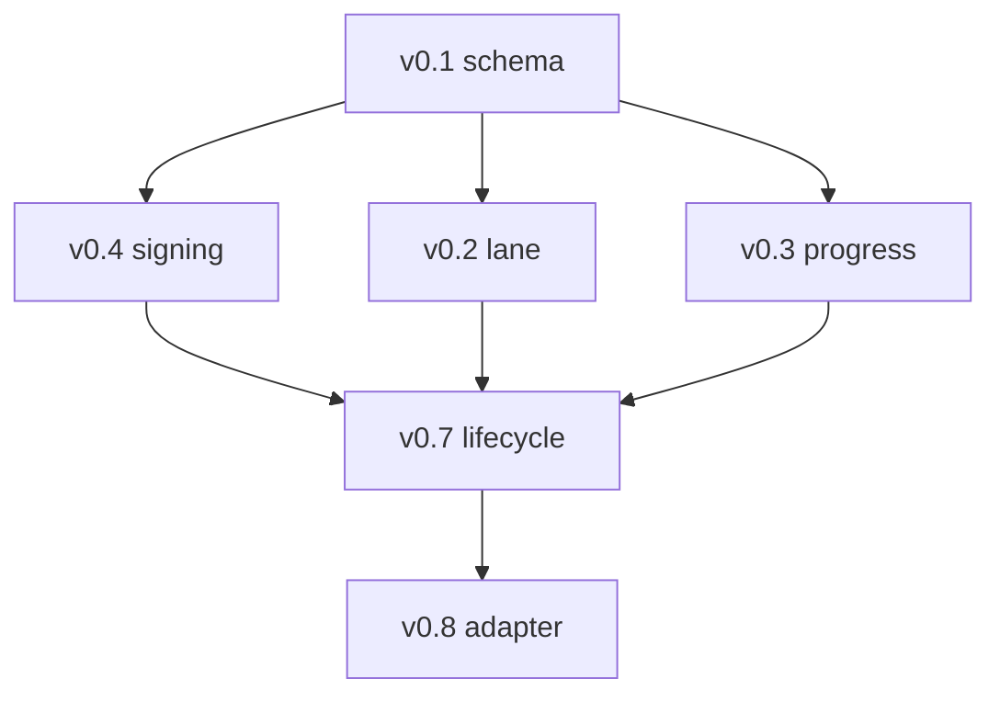

# ADC Base Stack Integration Review — 2026-05-19

**Status:** operator review aid
**Scope:** ADC `#7361`, `#7358`, `#7360`, and packet PR `#7367`
**Branch:** `codex/adc-follow-on-deepening-20260519`
**No operator gate crossed:** no merges, labels, mark-ready, branch edits, or dispatches.

## Current PR truth

Read-only verification found the base stack stable:

| PR | Role | State | Draft | Head | Mergeability | Review | Check rollup |
|---|---|---:|---:|---|---|---|---|
| `#7358` | v0.2 lane-registry attachment | OPEN | yes | `d926a9749f23b8ac097a2ec8573df7e63a11f738` | MERGEABLE / BLOCKED | REVIEW_REQUIRED | 4 success, 2 skipped, 0 fail |
| `#7360` | v0.3 progress ledger evaluator | OPEN | yes | `7b0cf9ea426fe2cc78b3e7298f1db7618931a8db` | MERGEABLE / BLOCKED | REVIEW_REQUIRED | 17 success, 53 skipped, 0 fail |
| `#7361` | v0.4 HMAC signing | OPEN | yes | `9093ddbc48ac4dd2ccaa3364b527b660c089a41e` | MERGEABLE / BLOCKED | REVIEW_REQUIRED | 16 success, 52 skipped, 0 fail |
| `#7367` | continuation/readiness packet | OPEN | yes | `a1e9949a1975d61a489c7960e8618858862d827a` | MERGEABLE / BLOCKED | REVIEW_REQUIRED | 15 success, 20 skipped, 0 fail |

Verdict: stable. `#7361` and `#7367` heads match the prior READY_FOR_OPERATOR_REVIEW packet.

## Semantic stack



Legend: v0.1 is already on `main`; v0.4 signs contracts/receipts; v0.2 binds contracts into lane claims; v0.3 evaluates goal progress; v0.7 will add pause/halt/revoke; v0.8 will propagate contracts across worker families.

## File-overlap map

Current `main` already contains the v0.1 trust kernel. Some PR UI diffs include v0.1 files because the branches were cut before v0.1 landed; compare against current `origin/main` before deciding conflicts.

| File | `#7358` v0.2 | `#7360` v0.3 | `#7361` v0.4 | Integration note |
|---|---|---|---|---|
| `aragora/policy/__init__.py` | no net change vs current `main` | no net change vs current `main` | adds signing exports | Hotspot if stale branches replay old v0.1 hunks after v0.4 lands. |
| `aragora/policy/delegation_contract.py` | no net change vs current `main` | no net change vs current `main` | relaxes v0.1 `signature is None` rule and adds `DelegationContract.is_signed` | v0.4 must preserve v0.1 validation while enabling signed payloads. |
| `aragora/policy/predicate_oracle.py` | no net change vs current `main` | no net change vs current `main` | no net change vs current `main` | No expected conflict. |
| `scripts/claim_active_agent_lane.py` | adds contract fields and parent/root checks | no net change vs current `main` | no net change vs current `main` | Unique v0.2 surface; watch `_KNOWN_FIELDS`, `claim_lane`, parser, and main. |
| `scripts/evaluate_goal_progress.py` | — | new script | — | Unique v0.3 surface. |
| `scripts/sign_delegation_contract.py` | — | — | new script | Unique v0.4 surface. |
| `tests/policy/test_delegation_contract.py` | no net change vs current `main` | no net change vs current `main` | replaces v0.1 signature rejection with v0.4 signature tests | Expected semantic shift after v0.4. |
| `tests/policy/test_contract_signing.py` | — | — | new signing tests | Unique v0.4 surface. |
| `tests/scripts/test_claim_active_agent_lane.py` | adds contract-field tests | no net change vs current `main` | no net change vs current `main` | Unique v0.2 surface. |
| `tests/scripts/test_evaluate_goal_progress.py` | — | new evaluator tests | — | Unique v0.3 surface. |
| `tests/scripts/test_sign_delegation_contract.py` | — | — | new signing CLI tests | Unique v0.4 surface. |

## Merge-order risk analysis

The operator-facing gate remains:

```text
#7361 → {#7358, #7360}
```

That order makes semantic sense because signed contracts/receipts become available before downstream lifecycle and adapter work. It has one mechanical caveat: after `#7361` lands, GitHub must re-evaluate `#7358` and `#7360` against the new base. They are mergeable against current `main` now, but a post-v0.4 base may force a rebase if their stale v0.1 file hunks are still present.

Recommended operator posture:

1. merge/review `#7361`;
2. immediately re-check `#7358` and `#7360` mergeability and checks;
3. if either becomes `DIRTY`/`CONFLICTING`, ask that branch owner to rebase without changing scope;
4. merge/review `#7358` and `#7360` once they are again `MERGEABLE` and green.

Do not let an agent auto-merge or auto-rebase the base-stack branches unless the operator explicitly delegates that branch.

## Known semantic risks

### v0.4 signing environment sensitivity

`#7361` appears to make validation sensitive to signing-key availability. If `ARAGORA_CONTEXT_SIGNING_KEY` is set in a local or CI environment, validation paths may verify signatures that unsigned tests did not previously exercise.

Mitigation:

- run signing tests with `env -u ARAGORA_CONTEXT_SIGNING_KEY` first;
- add a second keyed smoke if the signing PR provides deterministic fixture keys;
- ensure v0.7/v0.8 prompts require explicit signed/unsigned dry-run policy.

### v0.2 force semantics

`#7358` reportedly adds parent/root contract fields to the lane registry. Review notes indicate possible mismatch between help text and behavior: `--force` may override a missing parent but not a mismatched `root_intent_id`.

Mitigation:

- verify tests cover missing parent, mismatched root intent, and `--force`;
- if behavior is intentionally stricter than help text, update the help text before merge.

### v0.3 progress ledger application

`#7360` should remain read-only unless `--apply` is passed. The evaluator must not silently mutate `.aragora/progress-ledger/*.jsonl` during dry-run or validation.

Mitigation:

- run dry-run tests first;
- inspect generated ledger path behavior;
- confirm no untracked ledger artifacts are created during post-merge tests unless explicitly requested.

## Post-merge validation commands

Run from a clean `main` checkout after each merge.

### After `#7361`

```bash
python -m py_compile aragora/policy/contract_signing.py scripts/sign_delegation_contract.py
env -u ARAGORA_CONTEXT_SIGNING_KEY python -m pytest \
  tests/policy/test_contract_signing.py \
  tests/policy/test_delegation_contract.py \
  tests/scripts/test_sign_delegation_contract.py \
  -q
```

Then re-check downstream PRs:

```bash
gh pr view 7358 --json headRefOid,mergeable,mergeStateStatus,reviewDecision
gh pr view 7360 --json headRefOid,mergeable,mergeStateStatus,reviewDecision
gh pr checks 7358
gh pr checks 7360
```

### After `#7358`

```bash
python -m py_compile scripts/claim_active_agent_lane.py
python -m pytest \
  tests/scripts/test_claim_active_agent_lane.py \
  tests/policy/test_delegation_contract.py \
  tests/policy/test_predicate_oracle.py \
  -q
```

### After `#7360`

```bash
python -m py_compile scripts/evaluate_goal_progress.py
python -m pytest \
  tests/scripts/test_evaluate_goal_progress.py \
  tests/policy/test_predicate_oracle.py \
  tests/policy/test_delegation_contract.py \
  -q
```

### Final stack smoke

```bash
python -m pytest \
  tests/policy/test_delegation_contract.py \
  tests/policy/test_predicate_oracle.py \
  tests/policy/test_contract_signing.py \
  tests/scripts/test_claim_active_agent_lane.py \
  tests/scripts/test_evaluate_goal_progress.py \
  tests/scripts/test_sign_delegation_contract.py \
  -q
```

## Rollback / revert guidance

If all three base PRs land and a stack-level issue appears, revert in reverse semantic order:

```text
#7360 or #7358 if isolated → #7361 last if signing caused the failure
```

Detailed guidance:

- Reverting `#7358` removes lane-contract fields and CLI flags. Do not delete existing lane-registry rows or JSON artifacts without explicit operator approval.
- Reverting `#7360` removes the progress evaluator. Do not delete any `.aragora/progress-ledger/*.jsonl` artifacts unless the operator explicitly names them.
- Reverting `#7361` restores unsigned-only validation. Signed contract/receipt artifacts created after v0.4 may fail validation after revert unless downstream readers tolerate stripped signatures.

## Operator checklist

- [ ] Read `#7361` diff and confirm signing-key handling is acceptable.
- [ ] Merge/review `#7361`.
- [ ] Re-check `#7358` and `#7360` mergeability/checks.
- [ ] Ask branch owners to rebase if either downstream PR becomes dirty.
- [ ] Merge/review `#7358` and `#7360` once clean.
- [ ] Run the final stack smoke.
- [ ] Only after all base PRs are on `main`, consider v0.7 dispatch.

## Stop conditions

Stop and do not dispatch v0.7 if any of these occur:

- `#7361`, `#7358`, or `#7360` develops failing checks;
- a downstream PR becomes `CONFLICTING`/`DIRTY` after `#7361`;
- signing validation depends on unavailable or non-deterministic secrets in CI;
- the operator has not explicitly authorized v0.7 after the base stack lands.
