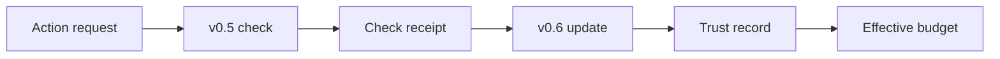

# ADC v0.5/v0.6 Hardening Addendum — 2026-05-19

**Status:** addendum to PR #7367 drafts
**Inputs reviewed:** `ADC_v0.5_SPEC_DRAFT.md` and `ADC_v0.6_SPEC_DRAFT.md` from PR #7367
**Scope:** docs-only clarification; no implementation or model wiring.

## Summary

The v0.5/v0.6 drafts are directionally sound. This addendum tightens four details before implementation prompts are issued:

1. v0.5 should define reviewer tiers without hard-coding vendor/model names.
2. v0.5 must be deterministic and mock-first before real model reviewers are allowed.
3. v0.6 needs explicit multiplier update math with floors, caps, and event weights.
4. v0.6 trust deltas should flow from v0.5 action-check receipts, not self-reported progress.

## v0.5 reviewer-tier policy

Keep reviewer tiers configurable by capability class instead of naming specific commercial models in the spec.

| Tier | Intended backend | Trigger | Output | Default authority |
|---|---|---|---|---|
| `T0_static` | pure policy code | every gated action | `PROCEED` / `HALT` with deterministic reason | may block |
| `T1_cheap` | low-cost model or local classifier | shared-state, delegation, optional bounded writes | structured adversarial verdict | may pause contested action |
| `T2_panel` | heterogeneous debate panel | worker disputes `T1_cheap` halt or confidence is low | `continue`, `narrow_scope`, `ask_human`, `halt` | may recommend, not override human gate |
| `T3_operator` | human/operator | destructive actions, ambiguous safety, policy conflicts | explicit approval/denial | final authority |

Implementation should expose model/provider selection through configuration:

```json
{
  "schema_version": "aragora-adversarial-reviewer-policy/0.5",
  "tiers": {
    "T1_cheap": {
      "backend": "configurable",
      "max_cost_usd": 0.01,
      "timeout_seconds": 20,
      "fallback": "HALT"
    },
    "T2_panel": {
      "backend": "configurable_heterogeneous_panel",
      "min_families": 2,
      "timeout_seconds": 120,
      "fallback": "ask_human"
    }
  }
}
```

The spec can mention examples in operator notes, but code and tests should never assume a specific model name.

## v0.5 mock-first path

The first implementation PR should not call real models. It should build:

- `ActionCheckRequest`
- `ActionCheckVerdict`
- `StaticActionPolicy`
- `MockAdversarialReviewer`
- `ActionCheckReceipt`

Minimum deterministic decision rules:

| Condition | Verdict |
|---|---|
| action target outside allowed surfaces | `HALT` |
| action class `destructive` without explicit human approval token | `HALT` |
| action class `delegation` and `max_depth == 0` | `HALT` |
| action class `delegation` and budget cannot fit child | `HALT` |
| lifecycle state `paused`, `halted`, or `revoked` for write/spawn | `HALT` |
| pure read action with no sensitive target | `PROCEED` |
| bounded write inside worktree/file globs | `PROCEED` |

Only after these deterministic tests pass should a feature-flagged real reviewer be added:

```text
ARAGORA_ADC_ADVERSARIAL_REVIEWER=mock|disabled|model
```

Default for tests and CI: `mock`.

## v0.5 receipt minimum

Every action check that gates an action should produce a receipt:

```json
{
  "schema_version": "aragora-adversarial-action-receipt/0.5",
  "request_id": "acr-...",
  "contract_id": "adc-...",
  "goal_id": "goal-...",
  "actor_session": "droid-...",
  "action_class": "shared_state",
  "target_surface": "branch:codex/example",
  "verdict": "HALT",
  "reason": "target branch outside allowed_surfaces",
  "tier": "T0_static",
  "confidence": 1.0,
  "reviewed_at_utc": "2026-05-19T00:00:00Z",
  "source_refs": {
    "contract_sha256": "...",
    "lifecycle_event_sha256": "..."
  },
  "signature": null
}
```

Receipts should be append-only and safe to feed into v0.6.

## v0.6 trust update math

Represent trust per `(agent_id, action_class)`.

Definitions:

```text
base = current_multiplier(agent_id, action_class)
delta = event_weight * severity_weight * evidence_confidence
raw = base + delta
next = clamp(raw, floor(action_class), ceiling(action_class))
```

Suggested event weights:

| Event | Weight |
|---|---:|
| signed completion receipt with all ACs satisfied | `+0.10` |
| draft PR opened with green checks | `+0.03` |
| merged PR without revert after observation window | `+0.15` |
| v0.5 `PROCEED` for shared-state action later validated by green checks | `+0.02` |
| v0.5 `HALT` that worker accepted/narrowed | `-0.05` |
| v0.5 `HALT` followed by attempted override without operator approval | `-0.20` |
| failed checks after branch push | `-0.10` |
| lifecycle `halt` | `-0.20` |
| lifecycle `revoke` | `-0.50` |

Suggested severity weights:

| Action class | Severity |
|---|---:|
| `read` | `0.25` |
| `bounded_write` | `0.75` |
| `shared_state` | `1.00` |
| `delegation` | `1.50` |
| `destructive` | `2.00` |

Positive deltas should be slower than negative deltas for risky classes. This asymmetry prevents one successful PR from immediately restoring delegation authority after a revoke/halt.

## v0.6 floors and ceilings

Carry forward the draft table, but make it configuration rather than code constants:

| Action class | New-agent default | Floor | Ceiling |
|---|---:|---:|---:|
| `read` | `1.00` | `0.50` | `3.00` |
| `bounded_write` | `0.75` | `0.25` | `2.00` |
| `shared_state` | `0.50` | `0.10` | `1.50` |
| `delegation` | `0.25` | `0.00` | `1.00` |
| `destructive` | `0.10` | `0.00` | `0.25` |

Effective budget stays capped by operator policy:

```python
effective_budget = min(
    contract_budget * trust_multiplier,
    operator_cap_for_action_class,
)
```

Trust can reduce or modestly expand a contract budget, but cannot exceed the operator cap and cannot authorize a denied action.

## v0.5 → v0.6 data flow



The v0.6 updater should accept v0.5 receipts only when:

- receipt schema is recognized;
- contract id and goal id are present;
- action class is present;
- verdict is `PROCEED` or `HALT`;
- source evidence is external or deterministic;
- receipt is signed when signed mode is required.

Self-reported worker progress may be included as context, but it must not directly change the trust multiplier.

## v0.6 append-only trust ledger

Suggested path:

```text
.aragora/delegation-contracts/trust-multiplier.jsonl
```

Suggested record:

```json
{
  "schema_version": "aragora-adc-trust-update/0.6",
  "agent_id": "droid-...",
  "action_class": "shared_state",
  "previous_multiplier": 0.5,
  "delta": 0.03,
  "next_multiplier": 0.53,
  "floor": 0.1,
  "ceiling": 1.5,
  "source_event": {
    "kind": "v0.5_action_check",
    "receipt_sha256": "...",
    "verdict": "PROCEED"
  },
  "updated_at_utc": "2026-05-19T00:00:00Z",
  "reason": "shared-state action proceeded and checks later passed",
  "signature": null
}
```

## Anti-gaming requirements

- The worker cannot update its own multiplier.
- Trust updates require external receipts or deterministic checks.
- Negative updates from `HALT`/`revoke` should apply before positive completion updates in the same time window.
- Same-family self-review must be recorded in the receipt and should reduce evidence confidence.
- Unknown receipt schemas are ignored, not guessed.
- Missing ledger or corrupt ledger should fail closed for multiplier increases and fall back to floor/default for budget computation.

## Implementation prompt guardrails

Future v0.5/v0.6 implementation prompts should include:

```text
Do not call real models in the first implementation PR. Build deterministic
mock-first surfaces, append-only receipts, and tests. Real reviewers and live
trust updates must remain behind explicit feature flags and operator approval.
```

```text
Do not let trust multipliers authorize actions forbidden by the Delegation
Contract, lifecycle state, destructive-action policy, or operator cap.
```

## Acceptance additions

Add these to the PR #7367 draft acceptance criteria before implementation:

1. v0.5 has deterministic `T0_static` tests before mock/model reviewers.
2. v0.5 real-model reviewer is feature-flagged and disabled in CI.
3. v0.6 update math clamps to configured floor/ceiling.
4. v0.6 negative deltas are applied before positive deltas in the same reduction window.
5. v0.6 ignores self-reported progress unless backed by external evidence.
6. v0.6 records the multiplier and source receipt in every dispatch receipt.
