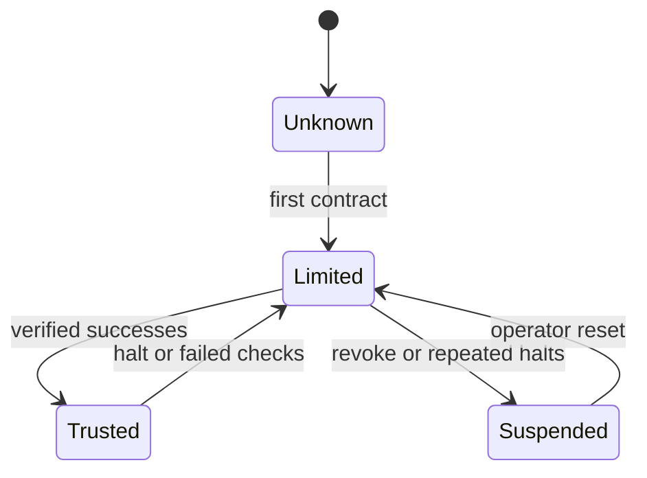

# ADC v0.6 Spec Draft — ELO Trust Multiplier

**Status:** draft for operator review
**Depends on:** ADC v0.1-v0.5 evidence surfaces
**Do not implement until:** v0.5 action-check receipts exist or the operator explicitly authorizes a narrower static-budget slice.

## Purpose

ADC v0.6 makes autonomy budgets trust-adjusted. A static budget is too permissive for unknown agents and too restrictive for agents with a long record of clean, verified work. v0.6 introduces a multiplier that scales contract budgets by agent reliability and action class.

```text
effective_budget = base_budget × trust_multiplier(agent_id, action_class)
```

## Problem

ADC v0.1-v0.4 encode scope and budget, but all agents with the same contract receive the same budget. That ignores observed history:

- new or unproven agents should get narrow budgets on risky actions;
- agents with clean receipts and merged work should earn more autonomy;
- agents that trigger halts/revocations should lose budget quickly;
- read-only work should not be penalized the same way as destructive/shared-state work.

## Prior art already in Aragora

Aragora already has agent skill tracking:

- `aragora/ranking/elo.py` tracks comparative agent performance.
- receipt conventions record lane outcomes.
- ADC v0.3 progress ledgers record goal progress.
- ADC v0.5 action-check receipts will record contested/blocked actions.

v0.6 should compose with these rather than creating a parallel reputation system.

## Trust multiplier model

Trust is per `(agent_id, action_class)`, not just global.

| Action class | New agent default | Floor | Ceiling | Notes |
|---|---:|---:|---:|---|
| read | 1.0x | 0.5x | 3.0x | Low blast radius; allow discovery. |
| bounded_write | 0.75x | 0.25x | 2.0x | Own worktree edits / draft docs. |
| shared_state | 0.5x | 0.1x | 1.5x | Lane claims, branch pushes, draft PRs. |
| delegation | 0.25x | 0.0x | 1.0x | Spawn child worker / issue child contract. |
| destructive | 0.1x | 0.0x | 0.25x | Still human-only unless explicitly granted. |

The default values are policy recommendations, not hard-coded constants. Implementation should make them configurable.

## Inputs

Trust updates should be based on verified events:

| Event | Effect |
|---|---|
| contract completed and acceptance criteria satisfied | increase multiplier for relevant action classes |
| draft PR opened with green checks | small increase for bounded/shared-state actions |
| merged PR without revert after observation window | larger increase |
| ADC v0.5 `HALT` verdict | decrease for action class that triggered halt |
| lifecycle `halt` event | decrease across bounded/shared/delegation classes |
| lifecycle `revoke` event | strong decrease; delegation may go to zero |
| failed checks after branch push | decrease shared-state multiplier |
| repeated no-progress ledger ticks | decrease bounded-write multiplier |

All updates must cite a receipt, PR, check run, or progress-ledger tick.

## Data model

Draft record:

```json
{
  "schema_version": "aragora-adc-trust-multiplier/0.6",
  "agent_id": "droid-...",
  "action_class": "shared_state",
  "multiplier": 0.75,
  "updated_at_utc": "2026-05-19T00:00:00Z",
  "source_event": {
    "kind": "pr_checks_green",
    "pr": 7367,
    "receipt_sha256": "..."
  },
  "previous_multiplier": 0.5,
  "reason": "draft PR opened with green checks"
}
```

Storage should be append-only JSONL first, with a later move to a persistent store if needed.

## Budget application

The contract still defines the hard base budget. Trust only scales downward/upward within policy caps.

```python
effective = min(
    contract_budget_for_action * trust_multiplier,
    operator_max_budget_for_action,
)
```

If the contract explicitly sets `trust_multiplier_override`, that override must be operator-signed and recorded in the receipt.

## Anti-gaming

- The agent should not update its own multiplier.
- Multipliers update from external receipts/checks, not self-reported progress.
- The worker may know its current budget, but not the exact pending update formula for the current action.
- Collusion checks are out of scope for v0.6 but should be called out in receipts when the same agent family verifies itself.

## Aragora wiring

Potential implementation surfaces:

- `aragora/ranking/elo.py`: source of baseline reliability where available.
- `aragora/policy/delegation_contract.py`: apply trust-adjusted effective budget.
- ADC v0.3 progress ledger: no-progress / regression signals.
- ADC v0.5 adversarial checks: contested action signals.
- ADC v0.7 lifecycle: halt/revoke signals.
- ADC v0.8 launcher adapter: effective budget propagation into child process environment.

## State transitions



## Acceptance criteria

An implementation PR should prove:

1. New agents receive lower multipliers for delegation/destructive classes than read-only classes.
2. A green-check receipt increases the bounded/shared multiplier within caps.
3. A halt/revoke event decreases the relevant multiplier.
4. Multipliers cannot raise effective budget above operator cap.
5. Trust updates require a cited external event.
6. Agent self-reported progress alone cannot update trust.
7. The trust multiplier used for a contract is recorded in the contract/dispatch receipt.

## Out of scope

- Federated trust across Aragora instances.
- Collusion detection between model families.
- Real-time marketplace pricing.
- Penalizing an agent for unrelated infrastructure failures unless the evidence ties to its action.
- Replacing human approval for destructive actions.

## Implementation guidance

Start with:

- `aragora/policy/trust_multiplier.py`
- `scripts/update_trust_multiplier.py`
- tests with synthetic receipts and lifecycle events

Do not wire to real model calls or live PR mutation in v0.6. Keep all update sources deterministic and receipt-backed.
