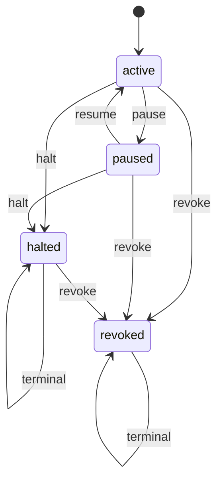

# ADC v0.7 Implementation Blueprint — Three-Tier Reversibility

**Status:** blueprint only
**Do not implement until:** ADC base stack `#7361 → {#7358, #7360}` lands on `main`, or the operator explicitly authorizes an integration branch
**No dispatch performed:** this document only describes the future implementation.

## Purpose

ADC v0.7 adds a lifecycle actuator to the Delegation Contract stack. Earlier ADC layers define and evaluate authority:

- v0.1: schema, validator, monotonic narrowing, predicate oracle;
- v0.2: lane-registry attachment;
- v0.3: progress ledger;
- v0.4: HMAC signatures for contracts and receipts.

v0.7 should make authority reversible without relying on process killing:

1. **pause** new work while preserving resumability;
2. **halt** a lane/contract when progress or safety gates fail;
3. **revoke** authority permanently across descendants.

## Design constraints

- Deterministic stdlib-first implementation.
- No LLM in the lifecycle trust kernel.
- No process killing as the primary safety mechanism.
- All state changes are append-only receipt events.
- Lifecycle checks must fail closed when contract state cannot be read.
- Destructive actions remain human-only.
- v0.7 must refuse dispatch if v0.1-v0.4 prerequisites are missing.

## State machine



### State semantics

| State | New read | New bounded write | New shared-state write | Spawn child | Resume? | Terminal? |
|---|---:|---:|---:|---:|---:|---:|
| `active` | allow | allow if contract permits | allow if contract permits | allow if depth/budget permits | n/a | no |
| `paused` | allow | deny by default | deny | deny | yes | no |
| `halted` | allow for audit only | deny | deny | deny | no | yes |
| `revoked` | allow for audit only | deny | deny | deny | no | yes |

`halted` means "stop this contract's work because progress/safety failed." `revoked` means "authority is withdrawn and descendants must fail closed."

## Proposed modules

### `aragora/policy/contract_lifecycle.py`

Core dataclasses:

```python
LIFECYCLE_SCHEMA_VERSION = "aragora-contract-lifecycle/0.7"

ContractState = Literal["active", "paused", "halted", "revoked"]
LifecycleEventKind = Literal["issue", "pause", "resume", "halt", "revoke", "tick"]

@dataclass(frozen=True)
class LifecycleEvent:
    schema_version: str
    contract_id: str
    goal_id: str
    event: LifecycleEventKind
    resulting_state: ContractState
    reason: str
    actor: str
    occurred_at: str
    parent_contract_id: str | None = None
    root_intent_id: str | None = None
    evidence: dict[str, str] = field(default_factory=dict)
    signature: str | None = None

@dataclass(frozen=True)
class LifecycleDecision:
    contract_id: str
    state: ContractState
    may_execute: bool
    may_spawn_child: bool
    reason: str
```

Core functions:

- `load_lifecycle_events(path: Path) -> list[LifecycleEvent]`
- `append_lifecycle_event(path: Path, event: LifecycleEvent) -> None`
- `get_contract_state(contract_id: str, event_paths: Iterable[Path]) -> ContractState`
- `evaluate_lifecycle(contract: DelegationContract, action_class: str, event_paths: Iterable[Path]) -> LifecycleDecision`
- `pause_contract(...) -> LifecycleEvent`
- `resume_contract(...) -> LifecycleEvent`
- `halt_contract(...) -> LifecycleEvent`
- `revoke_contract(...) -> LifecycleEvent`
- `descendant_contract_ids(root_or_parent: str, registry_paths: Iterable[Path]) -> set[str]`

Implementation should keep state reduction deterministic:

```text
revoked wins over halted wins over paused wins over active
latest valid event wins inside the same precedence tier
invalid or unreadable lifecycle ledger => fail closed for writes/spawns
```

### Ledger path

Default repo-local path:

```text
.aragora/delegation-contracts/lifecycle.jsonl
```

This path should be configurable for tests. Production code should not create or delete arbitrary files outside the repo or user Aragora state root.

## Proposed scripts

### `scripts/update_contract_lifecycle.py`

CLI:

```bash
python scripts/update_contract_lifecycle.py \
  --contract path/to/contract.json \
  --event pause \
  --reason "operator hold before base-stack merge" \
  --actor operator \
  --ledger .aragora/delegation-contracts/lifecycle.jsonl \
  --json
```

Flags:

- `--contract PATH`
- `--event pause|resume|halt|revoke`
- `--reason TEXT`
- `--actor TEXT`
- `--ledger PATH`
- `--parent-ledger PATH` optional, repeatable
- `--json`
- `--dry-run`

Rules:

- `resume` is allowed only from `paused`;
- `halted` cannot resume;
- `revoked` cannot resume or halt;
- `revoke` may apply from any non-revoked state;
- mutation writes are append-only JSONL;
- dry-run prints the event that would be appended.

### `scripts/check_contract_lifecycle.py`

CLI:

```bash
python scripts/check_contract_lifecycle.py \
  --contract path/to/contract.json \
  --action-class delegation \
  --ledger .aragora/delegation-contracts/lifecycle.jsonl \
  --json
```

Exit codes:

| Exit | Meaning |
|---:|---|
| 0 | action may proceed |
| 2 | action refused by lifecycle state |
| 3 | invalid contract |
| 4 | unreadable or invalid lifecycle ledger |
| 5 | dependency missing |

This script becomes the v0.8 `validate_parent_contract.py` dependency for lifecycle gating.

## Receipt fields

Every lifecycle receipt should include:

| Field | Purpose |
|---|---|
| `schema_version` | lifecycle receipt version |
| `contract_id` | primary contract |
| `goal_id` | goal binding |
| `root_intent_id` | authority-chain root |
| `parent_contract_id` | parent if any |
| `event` | pause/resume/halt/revoke/tick |
| `previous_state` | state before event |
| `resulting_state` | state after event |
| `reason` | operator or deterministic evaluator reason |
| `actor` | operator/session/tool |
| `occurred_at` | UTC timestamp |
| `evidence` | predicate/progress/check references |
| `signature` | v0.4 receipt signature when available |

If v0.4 signing is unavailable, v0.7 should write unsigned dry-run receipts only when the operator explicitly selects unsigned mode. Default dispatch mode should require signing once `#7361` lands.

## Integration points

### v0.1 schema and predicate oracle

`DelegationContract` remains the authority object. v0.7 should not add lifecycle mutable fields directly to the frozen contract dataclass. Lifecycle state is external, append-only, and reducible from events.

Predicate-oracle integration can add deterministic predicates later:

- `contract_active(path_or_id)`
- `contract_not_revoked(path_or_id)`
- `contract_state(path_or_id, state)`

Do not add these predicates until lifecycle storage format is stable.

### v0.2 lane registry

Lane claims should store:

- `delegation_contract_id`
- `parent_contract_id`
- `root_intent_id`
- optional `lifecycle_state`
- optional `lifecycle_checked_at`

v0.7 should not depend on the lane registry as the sole source of truth. It may mirror lifecycle state there for operator snapshots, but the lifecycle ledger remains canonical.

### v0.3 progress ledger

Progress evaluation should emit a lifecycle recommendation, not directly kill or revoke:

- repeated no-progress ticks → `pause` or `halt` recommendation;
- anti-signal predicate satisfied → `halt` recommendation;
- acceptance criteria complete → `halt` with reason `completed`, or `pause` if awaiting review.

The operator or contract policy determines whether recommendations auto-append lifecycle events.

### v0.4 signing

Lifecycle events should be signed as receipts once v0.4 is present:

- `sign_receipt(event_payload, key)`
- `verify_receipt(event_payload, signature, key)`

v0.7 must refuse signed-required mode when v0.4 symbols are absent.

## Dependency checks

Before any v0.7 dispatch/implementation worker starts, the launcher should verify:

```python
required_main_symbols = [
    "aragora.policy.DelegationContract",
    "aragora.policy.GoalSpec",
    "aragora.policy.evaluate_predicate",
]

required_after_7361 = [
    "aragora.policy.sign_contract",
    "aragora.policy.verify_contract",
    "aragora.policy.sign_receipt",
    "aragora.policy.verify_receipt",
]
```

Fail-closed behavior:

| Missing | Behavior |
|---|---|
| v0.1 contract symbols | refuse immediately |
| v0.2 lane fields | allow policy-module tests, refuse launcher integration |
| v0.3 progress evaluator | allow lifecycle module, refuse progress-trigger integration |
| v0.4 signing symbols | allow unsigned test mode only; refuse signed-required dispatch |

## Test plan

Suggested files:

- `tests/policy/test_contract_lifecycle.py`
- `tests/scripts/test_update_contract_lifecycle.py`
- `tests/scripts/test_check_contract_lifecycle.py`
- `tests/scripts/test_claim_active_agent_lane.py`
- `tests/scripts/test_evaluate_goal_progress.py`

Core tests:

1. new contract reduces to `active` with no events;
2. `pause` blocks writes and child issuance but permits audit reads;
3. `resume` from `paused` returns to `active`;
4. `resume` from `halted` fails;
5. `revoke` terminally blocks all writes/spawns;
6. `halt` terminally blocks all writes/spawns but preserves audit reads;
7. `revoked` outranks later stale `resume`;
8. unreadable ledger fails closed for write/spawn checks;
9. lifecycle event JSONL append is atomic and sorted by occurrence during reduction;
10. descendant revocation finds child contracts through lane-registry metadata;
11. v0.4 signing symbols are used when present and skipped only under explicit unsigned mode;
12. scripts return documented exit codes.

## Implementation sequence

1. Add pure dataclasses and reducer in `contract_lifecycle.py`.
2. Add deterministic tests with temporary JSONL ledgers.
3. Add `check_contract_lifecycle.py` read-only CLI.
4. Add `update_contract_lifecycle.py` append-only CLI.
5. Wire optional lane-registry mirroring after v0.2 fields exist on `main`.
6. Wire optional progress-trigger recommendations after v0.3 exists on `main`.
7. Wire signing after v0.4 exists on `main`.
8. Only after all deterministic tests pass, prepare v0.8 adapter integration.

## Operator-ready acceptance criteria

A v0.7 implementation PR should not be considered ready until:

- it is based on a branch containing v0.1-v0.4;
- lifecycle reducer tests pass without network or model calls;
- CLI scripts have deterministic exit codes;
- signed-required mode fails closed when v0.4 symbols are absent;
- paused/halted/revoked states block child issuance;
- lifecycle receipts are append-only and cite evidence;
- final documentation states that process killing is not the primary enforcement mechanism.
