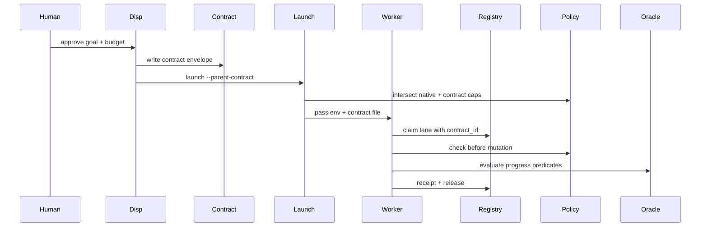

# ADC v0.8 Cross-Family Adapter Plan

**Date:** 2026-05-19
**Status:** planning artifact
**Depends on:** ADC v0.1 (#7357), v0.2 (#7358), v0.3 (#7360), v0.4 (#7361), and v0.7 (three-tier reversibility)

## Purpose

ADC v0.1-v0.4 made delegation contracts typed, attachable to lane claims, progress-measurable, and signable. The remaining gap is cross-family enforcement: a Claude, Factory Droid, Codex CLI, or Codex Desktop worker can still be launched without reading the parent contract that authorized it.

v0.8 turns the contract into a launcher-level boundary. A dispatcher passes `--parent-contract <path>` when spawning a worker. The launcher validates the contract envelope, intersects it with the harness's native permissions, and gives the child worker only the narrowed effective authority.

## Non-goals

- Do not replace existing harness safety layers.
- Do not grant a child worker any permission not already allowed by the harness.
- Do not implement per-tool enforcement in the first v0.8 slice; start with launch-time validation, environment propagation, lane-registry binding, and receipt linkage.
- Do not force every family to adopt a complete ADC runtime at once. v0.8 starts with a droid-first adapter and stubs for Claude/Codex surfaces.
- Do not launch or control live workers from this plan document.

## Architecture



Legend: `Disp` = dispatcher, `Registry` = lane registry, `Oracle` = deterministic predicate oracle.

## Contract-on-disk envelope

The cross-family lingua franca is a canonical JSON envelope written into the dispatcher's worktree and copied into the child worktree.

```json
{
  "schema_version": "aragora-contract-envelope/0.8",
  "envelope_id": "adc-env-...",
  "created_at_utc": "2026-05-19T00:00:00Z",
  "issuer_family": "claude|droid|codex|factory|operator",
  "target_family": "droid|claude|codex",
  "parent_contract_id": "adc-...",
  "contract": {},
  "goal": {},
  "signature": "hex-or-null",
  "launcher_metadata": {
    "repo": "synaptent/aragora",
    "base_ref": "origin/main",
    "lane_id": "ADC-v0.8-cross-family-adapter",
    "dispatch_tool": "launch_lane.sh"
  }
}
```

Rules:

1. `contract` is the v0.1 `DelegationContract` payload.
2. `goal` is the v0.1 `GoalSpec` payload or a `goal_id` reference if the full goal spec is already stored locally.
3. `signature` uses v0.4 signing when available; unsigned envelopes are permitted only for explicit dry-run/dev modes.
4. The launcher must copy the envelope into the child worktree as `ADC_PARENT_CONTRACT.json` and set `ARAGORA_PARENT_CONTRACT=<absolute-path>`.
5. Receipts must include `envelope_id`, `contract_id`, `goal_id`, and `parent_contract_id`.

## Permission intersection

The adapter never widens authority. Effective permissions are the intersection of three sets:

```text
effective_allowed = native_allowed ∩ contract.allowed_actions ∩ adapter_capabilities
effective_denied  = native_denied ∪ contract.denied_actions ∪ adapter_denied
effective_budget  = min(native_budget, contract_budget, adapter_budget)
```

If an action is both allowed and denied, denied wins.

### Action classes

| Class | Examples | v0.8 handling |
|---|---|---|
| read | file read, grep, PR metadata read | allowed when within contract scope |
| bounded_write | edits in child worktree, draft PR | allowed only when contract permits matching file/branch surfaces |
| shared_state | lane registry claim, branch push | requires contract id binding in the lane row / receipt |
| destructive | force-push, delete worktree, kill process | denied unless explicit human-only path exists; v0.8 should not automate it |
| delegation | spawn subagent | allowed only when `max_depth > 0` and child contract narrows parent |

## Adapter targets

### 1. Droid adapter (primary)

This is the first real implementation target because Factory Droid workers are already launched through wrapper scripts.

Implementation shape:

1. Add a tracked wrapper or extend the existing tracked launcher surface with `--parent-contract <path>`.
2. Validate the envelope before spawning `droid exec`.
3. Copy the envelope to the worker worktree as `ADC_PARENT_CONTRACT.json`.
4. Export:
   - `ARAGORA_PARENT_CONTRACT`
   - `ARAGORA_DELEGATION_CONTRACT_ID`
   - `ARAGORA_GOAL_ID`
   - `ARAGORA_CONTRACT_ENVELOPE_ID`
5. Inject a short preamble into the worker prompt requiring:
   - lane claim with `delegation_contract_id`;
   - receipt fields binding to the envelope;
   - no action outside the effective permission set.

### 2. Claude adapter (stub)

Claude Code does not expose the same generic launch surface in this repo. v0.8 should define a stub contract-reader that a Claude session can run at startup:

```bash
python3 scripts/validate_parent_contract.py --parent-contract "$ARAGORA_PARENT_CONTRACT"
```

The stub should validate and print the effective scope but does not claim to enforce tool calls inside Claude Code. That honesty boundary is important.

### 3. Codex adapter (stub)

Codex CLI / Desktop surfaces should start as read-only validation and receipt binding:

- validate envelope before a Codex worker starts;
- record `contract_id` / `goal_id` in lane claim metadata;
- include the fields in receipts;
- defer deeper Codex runtime control to a later family-specific integration.

## Lifecycle integration

v0.8 should depend on v0.7 for pause / halt / revoke state. Launchers should check contract state at startup:

| State | Launch behavior |
|---|---|
| active | proceed |
| paused | refuse launch with clear message |
| halted | refuse launch; terminal |
| revoked | refuse launch; verification fails |

For already-running workers, v0.8 only requires a heartbeat-level poll. Hard process control is out of scope for the first slice.

## Build sequence

1. Land or integrate v0.1-v0.4 per `ADC_v0.1-v0.4_STACK_AUDIT.md`.
2. Land v0.7 lifecycle state machine.
3. Add `scripts/validate_parent_contract.py`.
4. Add contract-envelope dataclass/helpers under `aragora/policy/contract_envelope.py`.
5. Add droid launcher support for `--parent-contract`.
6. Add lane-claim / receipt binding checks.
7. Add Claude/Codex validation stubs.
8. Dogfood by launching the next droid mission with a parent contract and verifying the worker claims the lane with the contract id.

## Acceptance criteria

- A valid signed envelope can be validated and copied into a child worktree.
- An invalid, revoked, halted, or paused envelope refuses launch before any worker starts.
- The droid launch path exports contract environment variables.
- The child lane claim contains `delegation_contract_id`.
- The worker receipt contains `envelope_id`, `contract_id`, and `goal_id`.
- Tests cover permission intersection, denied-wins behavior, budget min behavior, paused/halted/revoked launch refusal, and unsigned-dev-mode handling.
- The first dogfood worker launched after v0.8 is contract-bound.

## Threat model

| Threat | v0.8 mitigation |
|---|---|
| Permission laundering across harnesses | parent contract is copied and validated at launch |
| Harness grants broader native permissions than parent intended | intersection rule narrows authority |
| Child claims a lane without contract binding | lane-registry check rejects or flags it |
| Revoked contract is reused | v0.7 lifecycle check refuses launch |
| Worker fabricates progress | v0.3 predicate oracle remains deterministic and non-LLM |
| Adapter overclaims enforcement | Claude/Codex adapters are explicitly stubs until hard enforcement exists |

## Open operator decisions

1. Should unsigned envelopes be allowed for local dry-run only, or forbidden entirely once v0.4 is merged?
2. Should the first droid adapter extend the existing dispatcher script, or add a new tracked `scripts/launch_contract_bound_droid.py` wrapper?
3. Should a paused contract block launch only, or also ask active workers to release their lane immediately?
4. Should contract-bound dispatch be required for all ADC lanes after v0.8, or initially opt-in?

## Recommended next implementation slice

Implement the droid adapter first, not the entire cross-family matrix. The smallest useful PR is:

- `aragora/policy/contract_envelope.py`
- `scripts/validate_parent_contract.py`
- tracked droid launcher wrapper with `--parent-contract`
- tests for envelope validation and permission intersection
- one dogfood receipt showing a contract-bound droid launch in dry-run or draft mode

That slice makes v0.8 real without claiming full hard enforcement for Claude/Codex yet.
