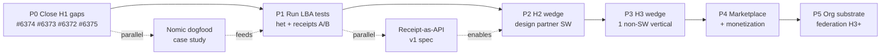

# Spec: Aragora — Best Next Steps Toward Thesis & Maximalist Vision

> **Provenance.** Drafted by Factory Droid on 2026-04-25 as a thesis-grounded sequencing artifact. Ported into the canonical doc chain on 2026-04-28.
>
> **Gating status (per `docs/status/NEXT_STEPS_CANONICAL.md`).** Phase 0 is canonical and on the live queue — it is the four named Implementation gaps already tracked in `docs/THESIS.md` (#6372, #6373, #6374, #6375). **Phases 1–5 are planning truth only**, gated on Phase 0 closure plus the proof-first Foreman gate. No issue under Phases 1–5 may carry `boss-ready` until that gate opens. This is the same treatment applied to the Epistemic CI / Crux Engine tranche (#6023–#6028, #6030–#6033) and the Dialectical Runtime synthesis layer (DIC-23..28).

---

## Grounding (what the thesis actually says)

`docs/THESIS.md` is the canonical authority. It commits to a strict H1→H2→H3 sequence, six load-bearing testable assumptions, five concrete commitments, and four named **Implementation gaps** between the thesis and current code:

| Gap | What's missing | Tracked issue |
|-----|----------------|---------------|
| Auto-handle path calibration | richer invalidation sources, finer decision-class fingerprints | #6372 |
| Triage metrics | rolling-window metrics (current code only emits daily counts) | #6373 |
| PR-review source-of-truth alignment | `pr_review_protocol.py` still defaults to `metadata_heuristic` | #6374 |
| Empirical threshold grounding | the 5% auto-handle invalidation cap is still a placeholder | #6375 |

The **bounded queue** in `docs/STATUS.md` is exactly these four issues, in that order. **Until they close, H1 ("Aragora maintains Aragora") is not actually validated**, and no later horizon can be claimed honestly.

The maximalist vision is *infrastructure for truth-seeking for both humans and AI agents*. The thesis is explicit that generalization beyond software (premise 6 / H3) is a load-bearing assumption to TEST, not a promise. The single most important strategic move is therefore to **earn the right to make later claims** by actually closing H1 and empirically running the six load-bearing tests.

## Proposed sequence

### Phase 0 — Close H1 first (2-3 weeks). Non-negotiable. *(canonical / live queue)*

The thesis says we are in H1 and names exactly four gaps. Anything else is premature.

1. **#6374 — PR review source-of-truth alignment.** Stop letting `pr_review_protocol.py` default to `metadata_heuristic`; PDB execution path becomes canonical. Update STATUS docs and any heterogeneity-claim surfaces.
2. **#6373 — Rolling-window triage metrics.** Extend `aragora/server/handlers/review_queue.py` from daily counts to rolling-window: escalation rate, auto-handle override rate, override↔outcome correlation, time-per-settlement. Surface in dashboard + settlement receipts.
3. **#6372 — Calibration + drift gating refinement.** Richer invalidation sources beyond merge-confirmed-success; finer decision-class fingerprints once samples accumulate.
4. **#6375 — Empirical threshold grounding.** Replace the 5% placeholder with measured baseline + safety margin from accumulated settlement data. Recalibrate per rolling window.

**Exit criterion:** all four gaps closed; STATUS.md updated; thesis commitment 3's three measurement axes (calibration error trending down, dissent-changes-verdict ≥15%, auto-handle invalidation < baseline) reportable from real settled data.

### Phase 1 — Run the load-bearing-assumption tests (3-4 weeks) *(planning truth — gated on Phase 0)*

The thesis lists six testable assumptions. Two are urgent because they decide whether premise 3 (no safe single-agent delegation) actually holds in practice:

5. **Shared-context contamination probe.** Feed adversarial / poisoned context to a heterogeneous panel; measure independent-flag rate vs catastrophic-correlation rate. Success criterion already specified in thesis (>60% / <30%). This tests whether our "heterogeneity" is real or theatrical.
6. **With-receipt vs without-receipt A/B.** On matched decisions, measure approval-latency delta, pilot-continuation rate, willingness-to-deploy. *Willingness-to-pay alone is confounded — the thesis explicitly disallows it*. This validates whether cryptographic receipts produce trust that matters to buyers (load-bearing for H2).

These two probes determine whether we proceed to H2. If they fail, the architecture is wrong, not the strategy.

### Phase 2 — H2 wedge: external software execution (4-6 weeks) *(planning truth — gated on Phases 0+1)*

Only after Phase 0+1 pass.

7. **Design-partner pilot on 3 external repos.** Bounded autonomous engineering work; each merge emits a receipt; outcomes (revert rate, downstream incidents, override correlation) feed back per premise 5. The cryptographic-receipts assumption gets its real-world stress test here.
8. **Heterogeneity-as-a-product** — package the panel-rotation, separate-retrieval, provider-differentiation discipline as a settable knob design partners can audit. This is what differentiates Aragora from "we use multiple models."
9. **Receipt-as-API v1.** Public schema, signed, content-addressable, cross-consumable by other AI systems. This is the maximalist move that lets *other AI agents* consume Aragora-issued claims — the thesis is explicit that "the audience includes AI agents."

### Phase 3 — H3 wedge: one non-software vertical (6-8 weeks) *(planning truth — gated on Phase 2)*

Premise that the pattern generalizes is load-bearing. The thesis demands at least one non-software domain wedge reaches tier-3 (operational objective truth) **without per-domain hand-tuning that fails to transfer**.

10. **Pick Legal** as the first non-software wedge. Highest receipt $-value, clearest evidence/dissent/audit fit, tractable outcome feedback (matter outcomes, billed-hour deltas). Alternatives: Financial risk; Healthcare HIPAA-bounded second-opinions. Legal recommended; user decides.
11. Ship 3 hero workflows: contract-clause review, due-diligence Q&A, litigation-strategy debate. Each must hit tier-3 within its outcome-feedback window or honestly fail.
12. **Generalization audit** — measure how much of the substrate transferred zero-modification vs needed per-domain engineering. The transfer ratio is the actual H3 metric.

### Phase 4 — Marketplace + monetization (6-8 weeks, parallel-able) *(planning truth — gated on Phases 0+2 or 0+3)*

Only valuable once H1 closed and at least one of H2/H3 has tier-3 evidence.

13. **Marketplace v1** with vetted templates from each validated wedge.
14. **Receipt-tier pricing** — pricing is per *settled receipt* with audit trail, not per token. This is consistent with thesis: receipts are the unit of value.
15. **Self-serve via Stripe**, dogfooded through Aragora's own policy-vetting (every customer policy debated through the platform).

### Phase 5 — Organization substrate (H3+, 8-12 weeks) *(planning truth — gated on Phases 0–4)*

The endpoint of the thesis: coordinated agentic work across functions on one graph with permissioned memory, shared receipts, portfolio-level truth-seeking. **Not a near-term promise**; gated on Phases 0-4.

16. Cross-workspace federation, permissioned memory graph, portfolio receipts.
17. Inter-org receipt verification — a receipt from org A can be consumed and counter-debated by org B.

### Cross-cutting (always-on, in parallel with Phases 0-3)

- **Nomic Loop public dogfood case study** — pick one real Aragora bug, drive Nomic Loop end-to-end, publish the full receipt chain. This is the strongest possible evidence H1 is real.
- **CI velocity** — build on #6588 (sub-sharding shipped today): drop test-fast wall-clock under 8 min; @pytest.mark.slow audit; promote test-fast to required only after stability proven.
- **SOC 2 Type II audit kickoff** — 12-month process, start now; required for enterprise H2 buyers.
- **p95 receipt latency under 60s** — semantic caching, tier routing (Smart Provider Routing already landed), batched debate.
- **Docs-claim audit cadence** — continue weekly per #6582 model, tied to canonical metrics.

## Key tradeoffs (decisions the user should make)

1. **H3 vertical pick.** Legal (recommended) vs Financial vs Healthcare — different outcome-feedback timescales. Legal has the cleanest receipt $-value but Financial has fastest outcome loops.
2. **Maximalist receipts move timing.** Ship Receipt-as-API v1 in Phase 2 (early) or wait until Phase 4 (after monetization)? Early enables ecosystem; late protects differentiation.
3. **Pace of H2 design-partner outreach.** 3 partners in Phase 2 vs 10? More partners = more outcome data = faster thesis validation, but slower per-partner depth.

## Anti-patterns to avoid (per thesis)

- Marketplace-first or distribution-first work before H1 closes — violates premise 1 (we'd be shipping unsubstantiated claims).
- "Decision-of-the-Week" public-PR-debate stunts — premature; the receipt machinery isn't yet validated by the assumption-tests.
- Vertical breadth before vertical depth — the thesis explicitly demands one wedge to tier-3, not three to tier-2.
- Marketing the Nomic Loop as autonomous before the four H1 gaps close — would violate commitment 4 (don't claim what we can't arbitrate).

## Definition of done for this roadmap

- All four named Implementation gaps closed in code, with rolling-window metrics live.
- Two load-bearing-assumption probes have published results (pass or honest-failure).
- At least one H2 design-partner pilot in production with receipts feeding real outcomes back.
- One H3 wedge has tier-3 evidence in its outcome-feedback window.
- Receipt-as-API v1 published and consumed by at least one external system.
- Pricing live, tied to receipt count, with at least one paying customer.

## Alternatives the user can pick from

(Section was sketched in the original Factory spec but not filled in. Captured here as a placeholder for future divergent-sequencing options — e.g., distribution-first via marketplace, vertical-first via Legal/Financial/Healthcare ahead of H2 software wedge, or receipts-API-first to enable ecosystem before pilots. The strict thesis-first sequencing above remains the recommended path.)

---

## See also

- [`docs/THESIS.md`](../THESIS.md) — canonical authority; six premises, four implementation gaps, six load-bearing assumptions, four tiers of "true"
- [`docs/CANONICAL_GOALS.md`](../CANONICAL_GOALS.md) — eight doctrinal pillars, stage model, 60-day operating focus
- [`docs/plans/ARAGORA_EVOLUTION_ROADMAP.md`](ARAGORA_EVOLUTION_ROADMAP.md) — reverse-staged rocket B0→B4 (this spec is the *what*; the evolution roadmap is the *how-shaped*; this spec sits one layer above)
- [`docs/status/NEXT_STEPS_CANONICAL.md`](../status/NEXT_STEPS_CANONICAL.md) — current execution gate; Phase 0 here is on the live queue, Phases 1–5 are flagged as planning-truth-only
- [`docs/status/H1_01_REV4_PROMOTION_READINESS.md`](../status/H1_01_REV4_PROMOTION_READINESS.md), [`H1_02_SCORECARD_CONTRACT.md`](../status/H1_02_SCORECARD_CONTRACT.md), [`H1_03_SANITATION_GATE_CONTRACT.md`](../status/H1_03_SANITATION_GATE_CONTRACT.md), [`H1_04_LEDGER_SELF_HEAL_CONTRACT.md`](../status/H1_04_LEDGER_SELF_HEAL_CONTRACT.md) — concrete H1 contracts
